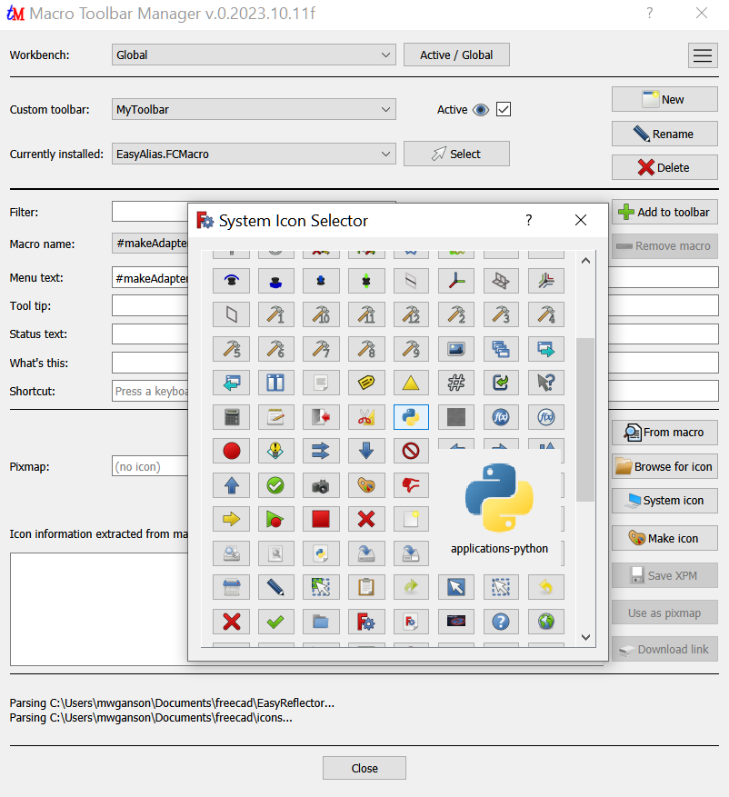
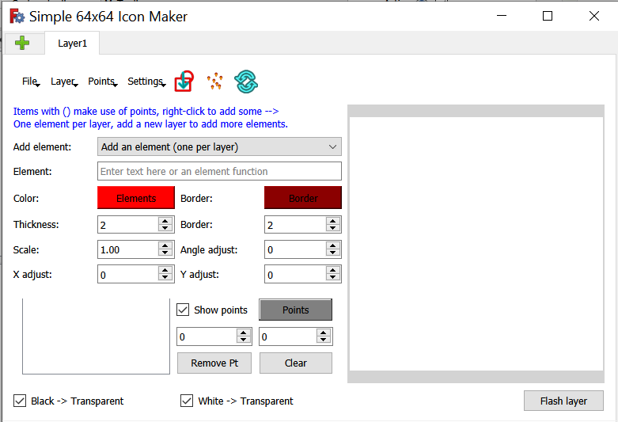

# MacroToolbarManager
Easily manage custom macro toolbars in FreeCAD

## Installation
Install using the Addon Manager.  Alternatively, copy the MacroToolbarManager.FCMacro file to your macro folder.  If you don't know where that folder is you can find it in Macro menu -> Macros or in the python console using:<pre>
App.getUserMacroDir(True)
</pre>

## Toolbar icon
The addon manager will install the toolbar icon for you upon installation.  Alternatively, a toolbar icon is embedded into the macro itself.  When you run the macro, select the MacroToolbarManager.FCMacro in the Macro names: combo box, then click the From macro button to extract the icon xpm data.  The icon xpm information text should appear in the extracted field in the macro window.  Click the Save XPM button, which should now be enabled, select a folder for the macro icon, and save it there.  It doesn't matter where you put the icon file.  The macro will tell FreeCAD where to find it.  Then click Add to toolbar button to add the macro to the toolbar.  If it's already in the toolbar, click Add to toolbar button anyway because this will update the new icon information.  Alternatively, you can download the SVG version:   

## Usage
Usage is fairly self-explanatory.  Here is a screenshot: 
 
 
 
I'll document from the top down.

### Workbench section

#### Workbench (combo box)
The Workbench combo box is where you select the workbench this toolbar will go into.  If you select Global, then that means the toolbar will be available for every workbench.  If you select a workbench, such as Part workbench, then the toolbar will go into that workbench and will only be visible while you are in that workbench.  This can be very useful if you want to reduce clutter and only have the macro icons that you need in a particular workbench.

#### Active/Global (button)
The Active/Global button will select the active workbench for you in the combo box rather than requiring you to search through all the installed workbenches to find it.  If the active workbench is already selected, then this button selects the Global option for you.  It's essentially a toggle switch.

#### Menu (button)
The menu button is the button to the far right at the top of the window.  I'll cover the menu items in the next section.

### Menu items
The menu is accessed by clicking the button in the far right top corner.
#### Settings
There is currently only one group in settings -> System Icons.  Note: this menu is also accessible via right-click context menu with the System icons button.

##### System Icons -> Parse Mod folders (boolean checked or unchecked)
Default: False (unchecked).  If checked (true) then when you use the System icons button it will parse the Mod folders for additional icons to display.  The Mod folders are where the addon workbenches get installed, so if you want to use an icon from an installed addon workbench, the you need to enable Parse Mod folders.  Alternatively, add the exact folder you want to fetch the icons from in the Manage icon folders dialog, documented next.  This option is false by default because it takes some time to parse all the Mod folders, depending on how many workbenches you have installed.

##### System icons -> Manage icon folders
FreeCAD allows you to specify additional icon folders to search for icons in.  This is used in the Customize dialog (Tools menu -> Customize) when you click the ... pixmap button when setting up an icon and then click the Icon folders... button.  Icons that exist in those folders will be added to the icon selection dialog in Customize.  We do the same thing here with the System icons button, which brings up a similar (but not exactly the same) set of icons to pick from.  The icon folders dialog implemented in the macro is substantially the same as the icon folders dialog implemented in FreeCAD.  It allows you to add/remove additional icon folders.  Note: The first folder in the list is the one we use for a number of default folders when saving or loading icons, so you should setup at least one in this dialog so you can keep all your icons organized in the same place.

#### Load workbenches (action)
This will load all installed workbenches, one after another.  It will take a while, so be patient.  Why would you do this?  When adding a new shortcut keyboard accelerator, the macro checks for conflicts.  But only the loaded workbenches can be checked, so if you have a conflicting shortcut in use in a workbench that hasn't been loaded yet in this session of FreeCAD, then the conflict checker will not find the conflit.  So, use this option before setting up shortcut accelerator keys to be confident you have chosen one without conflicts.

#### Remove orphans (action)
Orphans are macro toolbar items whose macro actions have been removed.  They don't show up in the toolbar, but they're still in the parameters database.  This option purges the database of these derelict macro items.  It doesn't delete any files.

#### Delete macro (action)
Deletes the macro file from your macros folder.  There is a sanity check, but it's not reversable, so be careful.

#### Remove macro action (action)
This removes the macro action from Tools menu -> Customize -> Macros tab.  It does not delete the macro file.  It is disabled if the macro is currently installed on the current toolbar (but no check is made whether the macro is installed on some other toolbar).  You might be wondering what the heck is a macro action?  Qt uses Action, but sometimes FreeCAD refers to these as commands.  Every menu item has an action associated with it, and so does every toolbar item, whether its a macro item or some other item, it has an action associated with it.  The action is basically an object with information, such as the icon, shortcut, what command to execute when triggered, the tooltip, etc.  In order to put a macro to a toolbar you must first create the action, but don't worry, the macro handles that all automatically for you when you click the add to toolbar button.  But what the remove from toolbar button doesn't do is it doesn't remove the macro action.  This is because the macro might be installed on another workbench and we don't want to orphan it there by removing the action.

### Toolbar section

#### Custom toolbar (combo box)
This is where you select which custom toolbar you will be working with.  You can have as many toolbars as you like, but I recommend only 1 global toolbar and only 1 workbench-specific toolbar per workbench.  You can have as many as you like if you feel more than 1 toolbar better meets your needs.

#### Active (check box)
The Active checkbox is a way to hide/disable toolbars without deleting them.  If you can't find your toolbar, this might be the reason why: you have deactivated it and forgot about doing it or possibly it was done by mistake.

#### New (button)
Create a new custom toolbar in the currently selected workbench in the Workbench combo box.

#### Rename (button)
Rename a toolbar.  Take notice that there are 2 names associated with toolbars.  There is what I call a Real name and the name you can edit here.  Behind the scenes the toolbar's real name will be something like "Custom1" or "Custom2", and you might see it referred to by that name in various places in FreeCAD.  The name you set here is the one we interact with in the macro.  The names should be unique to avoid confusion, but there is no requirement that they be unique.  The real names will be unique, either way.

#### Delete (button)
Delete a toolbar.  There is a sanity check, but take care because this action cannot be undone.  This does not remove any macro actions or delete any macro files.  It just removes the toolbar.

#### Currently installed (combo box)
These are the macros currently installed (if any) on the currently selected toolbar.  If you select one it updates the selection in the Macro name combo box.  If you have a lot of macros, this is an easier, more convenient way to find one rather than digging through a long list of macro files in the Macro names combo box.  If the currentl selected installed macro is the one you want to select in Macro names, then use the Select button.

#### Select (button)
Click it to make the macro selected in the Currently installed combo box also the macro selected in the Macro name combo box.

### Macros section
Here we have all the fields associated with a given macro action.  Which macro is in the Macro name combo box.  What menu text to use in a menu or on a toolbar if there is no icon, what tool tip to display when the mouse pointer hovers over the icon, what text to display in the status bar when the pointer is over the icon, what what's this text to show in the help system, and what shortcut accelerator keys to use.  There is also a pixmap section, which have organize below in an icon section.

#### Filter (line edit)
You can filter which files will appear in the Macro names combo box by entering your filter here.  This is a search by regular expression (case-insensitive) unless it is an invalid regular expression, in which case, a simple text search is done on the filenames.  Only the matching files are shown in the Macro names combo box.  If this filter is empty, then no filtering is done, other than filtering by extensions .py, .FCMacro, and .fcmacro.  This is a convenient way to find a specific macro without needing to scroll through a long list of filenames for those of us with large numbers of macros installed.

#### Add to toolbar (button)
Add the current macro to the current toolbar.  Requirements: There must be a toolbar to put it on because it does not automatically create one.  There must be some menu text in the menu text field.  If those 2 requirements are met, then this creates the macro action (if necessary) and puts the macro on the toolbar.  If the macro is already on the toolbar, then this will replace/update it for you, for example, if you changed icons or shortcut or any of the other fields.

#### Remove from toolbar (button)
Remove the macro from the toolbar.  Does not delete macro file.  Does not remove macro action.

#### Macro name (combo box)
This is a list of all the macro files in your macros folder.  Note: the system macros folder is not supported by this macro.  The files listed are filtered by only those with .py, .FCMacro, or .fcmacro extensions.

### Icon section
Here is where we have all the widgets related to working with the icons.

#### Pixmap (line edit)
This holds the pixmap text associated with this macro action.  It can be a couple different things.  It can be the full path to an icon file or it can be the name of a system icon.  An example of a system icon is "applications-python", which is the generic python icon used for the macro text editor built into FreeCAD.  When you use some of the buttons in this section the macro will update this pixmap text for you.

#### Icon (label)
There is a label after the Pixmap line edit between it and the buttons to the right side. If it contains a black X on a white background, that signifies the Pixmap field does not contain valid information to produce an icon.  If it has a different icon, then you should be good to go for putting it on the toolbar.

#### From macro (button)
Some macros have icon information embedded in their code in the form of string variables named __icon__ and __xpm__.  This button performs a scan of the actively selected macro in the Macro name combo box for this information, and the first one found gets extracted and put into the Icon information text area, the QPlainTextEdit widget below the Pixmap line edit.  The information might be a link to an online image, such as https://wiki.freecad.org/images/5/56/MacroToolbarManager_icon.svg, the svg macro file for this macro, or it might be the name of a system icon, or it might be the icon image in XPM notation.  It's up to you to figure out what it is and what to do with it.  If it's a url, then click the Download link button to download the file, save it in your icon folder, and setup the Pixmap text field to make use of it.  If it's the name of a system icon, then click Use as pixmap, or if it's in XPM format, click the Save XPM button to save it and setup the Pixmap text filed to make use of it.  (Note: the Make icon button will also fill up the Icon information text area with XPM data.)

#### Browse for icon (button)
Let's you browse for an icon file to use for this macro action.  The default folder it opens up in is the first icon folder you (might) have created already.  See System icons -> manage icon folders above for more details.  If no icon folders are defined, then it opens up in the macros folder.

#### System icon (button)
Note: This button also has a context menu.  Use this to browse for system icons, icon files in icon folders you have configured, and (optionally) for icon files in the Mod folders where the addon workbenches are installed.  When you click one of the icons in the dialog that pops up, it closes the dialog and sets up the pixmap text field for you.  Here is a screenshot:

All image files are parsed, but we only keep those that are 64 x 64 pixels are smaller for use as icons.

#### Make icon (button)
The macro provides a simple icon creator tool that you can use to make your own simple icons.  I used it, in fact, to make the xpm version of the icon for this macro, the blue t and the red M.  This functino makes use of openCV python package.  It comes bundled with FreeCAD, but if you self-compile you might not have it installed.  You can install with pip as pip install opencv-python.

Here is a screenshot:

The integrated icon maker can be used to create your own icons.  It has a layer system where each layer builds on the previous layer.  You put one element per layer, typically.  An element could be a rectangle, some text, a circle, etc.  Then you make a new layer and add the next element.  Changes to the bottom layer automatically get propagated to the top layer, which is a combination of all the previous layers, plus whatever element is added within that top layer.  At the top left corner of the dialog is a green plus button.  Click that button to create a new layer.  You can also create a new layer from the Layer menu.  There are instances where you might have multiple elements in the same layer, for example if you import a sketch or use the rectangles() tool to create multiple rectangles in the same layer.  All elements in a layer share the same color and (optionally) same border color.

You can use construction points to setup your elements.  For example, add 2 construction points (right click on the image label to create a construction point) and use those 2 points for the line() function or for the rectangle() function.  You can also simply add the points as elements to the layer using putpoints(), which adds point elements at those point locations.  Points can be edited after being placed in the Points box, the area at the bottom left of the dialog.  You can move a point, you can remove a point, you can clear all points, and set the color of the points there.  More options are available in the Points menu.  The points themselves are not part of the image that will eventually be produced for the icon.  They're construction mode elements, very similar to the construction mode elements you would use in a sketch.

### File menu
In the file menu you will find functions generally related to loading and saving files, plus an option to Quit the dialog.

#### Load project and Save project
Load project loads an icon project you would have saved earlier using Save project.  Projects are saved in text human readable JSON format.  Note: there is no warning if you quit before saving a project.  It's on you to remember to save.

#### Load base pixmap
You can load a base icon to begin working with.  Internally, each layer has a base pixmap and a pixmap.  The first layer can have an image loaded from disk or a system icon as its base pixmap.  For the other layers, the next lower layer is that layer's base pixmap.  This is quite useful if you have a workbench and you want all the icons to have a similar theme or if you have a similar function that just needs a slightly different icon or if you just want to make some changes to an existing icon.

#### Export XPM, PNG, SVG
Those are the 3 image options for exporting.  All of them support transparency.  At the bottom left corner of the dialog you will find 2 checkboxes related to using either black, white, or both, as the transparency color.  If you want both white and black in your icon, then you'll need to use a different color for the background, and manually edit the exported XPM code.  This is simple enough -- just find the character being used as the background and change whatever it's hexadecimal color representation is in the XPM code to "None".  The PNG option saves to a file.  The SVG option also saves to a file, but additionally the text making up the SVG file goes into the Extraction Plain Text Edit in the main macro dialog.  From there you can save it as an SVG and have the icon information in the Pixmap line edit filled in for you.  For XPM, it is not saved to a file, but rather it is only put into the Extraction text edit. You save it from there to a file.

### Layer menu
In this menu you can manage the layers.  You can add a new layer, remove the top layer, or recompute a layer.  Recompute is also available as a toolbar icon.  In some cases you might need to redo the operation rather than simply calling the recompute function.  You can only remove the top layer.  If you want to remove the contents of a layer in the middle of the project, just clear out the Element text edit for that layer.

### Points menu
In this menu there are functions dealing with points.  These are the construction points used for many element functions.  As stated above, points are not part of the image themselves, but rather are merely ways for you to communicate to the macro how you want the elements, which are part of the image, to be created.

#### Clear points
Empties out the points list.  Any function that brings in points, such as importing points, will also clear existing points.

#### Remove selected point
You select a point in the list widget in the Points box area.  When the point is selected it will flash briefly on the image label.  The last point added is always at the top of the list, followed by the previous point, etc.  When you select a point it's coordinates go into the 2 spin boxes in the Points box area, X to the left and y to the right.  You can edit the point coordinates there, and as you do, the point will move in the image label, so that's another way to identify a point selected.  Points cannot be selected in the image label.

#### Duplicate selected point
This removes the selected point from the list and from the label image.

#### Show points (boolean)
This is a checked menu item.  If checked, points are shown in the image label, otherwise they are not.  You can also toggle this via the checkbox in the dialog in the Points box area.

#### Apply transformation to points
This action also has an icon on the toolbar.  It's the one between the sketch import icon and the refresh icon.  This function applies 3 types of transformation to the points: scaling, rotating, and moving, taking the values from the 4 spin boxes just above the Point box area.  Normally, these spin boxes control the positions of elements, but in this case they pull the double duty of providing arguments to the Transform points function.  You need to set them back to their defaults afterwards or else the elments added will also be affected by them.  Use Shift + Command to undo the operation.  Use Alt + Command to keep the existing points in their current location and add new points in the new transformation.  This can be useful for rapidly adding lots of points.  For example, set Y adjust to 1, and press Alt + Transform icon after adding a single point to the screen, and this will make it a sort of Etch-a-sketch operation.  After going in the y direction for a few times, set Y adjust to 0 and X adjust to 1. Now the enter line gets duplicated in the X direction, using the first vertical line as a pen.  You can also use Alt + click on the 2 spin boxes in the Point box area to make use of this feature, but on an individual point level.

##### Rotating
Rotating is the first operation performed in a transformation.  Rotating first, then moving, and finally scaling.  Use the angle spin box to set the angle for the rotation.  This tends to work best with 90 degree angles.  That's because every point has to align with an integer value, and they are rounded to the nearest integer to make that happen.  At 90 degrees, 180 degrees, and 270 degrees they all always land on integer values and no rounding is needed, so there is no information lost in the rotation.  These losses get multiplied if you do the rotation in several steps, for example, moving 5 degrees at a time 3 times for a 15 degree move.  It is better instead to undo the previous 5 degree move with Shift + Transform, and then change the angle to 15 so you can do it all in one go.  (Unless you are using Alt + Command to add the new points at each stage.)

##### Moving (translating)
Set the X adjust and Y adjust spin boxes to set up the move, and then apply the transformation.  If scale is 1.0 and Angle is 0, then only a translation is done.

##### Scaling
Scaling is done relative to the center of the icon label, which is (32,32).  The origin in this coordinate system is to the upper left corner at (0,0), and the lower right corner is at (63,63).  Points furthere away from the center should be expected to move more with scaling than points neared to the center.  A point at the center should not move at all during scaling.  So, you might want to center your points first before scaling.

#### Backup points in memory / Restore points from memory
There is one storage slot available to store points in memory using this feature.  For undoing transformations, the slots are unlimited.  You can undo as many transformations as you like until you have undone them all.  Points stored in memory are transient, meaning they do not survive saving and loading the project.  It's just a temporary place to put some points for later recovery.  Each layer has its own storage slot.  Use the clipboard option to share points from one layer to another.

#### Copy points to clipboard / Paste points from clipboard
Self-explanatory.  Points are stored in text format on the clipboard.  You can paste them into a text editor to view them and modify them if you like, and then pasted the modified points back in.  Or you can save them to disk in a text file, if you like.  You could create a library of points, such as arrows, etc., and store them all in a text file for later retrieval via the clipboard.  You can also use the Load and Save points discussed below.

#### Import discretized edges of object
This lets you import selected edges of an object as discretized points, one point per millimeter of length of the edge.  Ensure the edges are all on or parallel to the xy plane or else you are likely to have an unexpected result.  All the z values are ignored during the import, effectively projecting the points to the xy plane.  If the edges are rotate relative to that plane, then the imported points will be distorted.  For example, a rotated cylinder's round top edge might come in as an ellipse if the cylinder is rotated about something other than the z axis.  In some cases this might be exactly what you want.  You should limit this to only one wire, or one set of connected edges.  Otherwise when you apply polyline() to the points you would get crossed lines connecting the wires where one point was the last point of one wire and the next point was the first point of the next wire.  The edges do not have to be on the same plane.

#### Import selected vertices
This lets you import selected vertices from one or more objects.  Like the disretized edges import these are also relative to the xy plane.

The text field supports using \n for a newline if you want more than a single line of text, but a maximum of only 2 lines are supported.  You can make a base image of the current icon, and then use it as the base icon to add more lines if you like.  Empty the text field, load in an image as Base icon, and export it as an XPM file to use this tool as an XPM converter that works well with FreeCAD.

The font choices are limited to those provided by openCV.  There is no way, as far as I know, to add additional fonts.  If you add more text and lose the image, try scaling back until you find it, and then drag to the center and rescale back up.

There are 2 check boxes that are self-explanatory.  All white and all black colors get set to transparency if these boxes are checked when you export to XPM.  When importing Base icons their transparent backgrounds are represented as black here, and when you start from scratch the background is represented as white here.  Checking and unchecking doesn't change the appearance of the icon in the editor, it just changes the XPM data upon export.

#### Save XPM (button)
Saves the contents in the Icon information text area as a text file.  You need to supply the .XPM extension.  If it's SVG data, then save in SVG format.  (But I don't think anybody puts SVG data into these __icon__ and __xpm__ fields, as far as I know.

#### Use as pixmap (button)
Uses the contents of the Icon information text area directly in the Pixmap field.

#### Download link (button)
Use this button to download the file in the url hyperlink in the Information text area, if such was extracted using the From macro button and placed into the text area.

#### Status section
There is a label above the Close button and below the Icon information field where messages are sometimes displayed.  Such messages are also echoed to the Report View, so if you think you missed something check there.  Messages in black text are normal messages, orange text means warnings, and red text indicates some sort of error occurred.

## Changelog
### v2023.10.19 -- Svg export, Png export, Construction points, Sketch import, Zooming, too many things to list.
### v2023.10.12 -- add border colors to text in icon maker dialog, scale to 256x256 instead of 200x200 for a better 4:1 pixel ratio
### v2023.10.11f -- initial version along with a few tweaks for the addon manager and for advising people who need to install opencv to make use of all the features.

